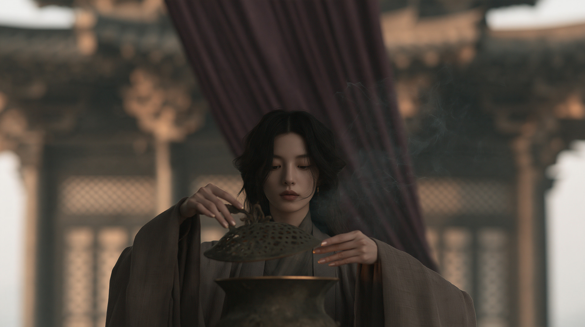
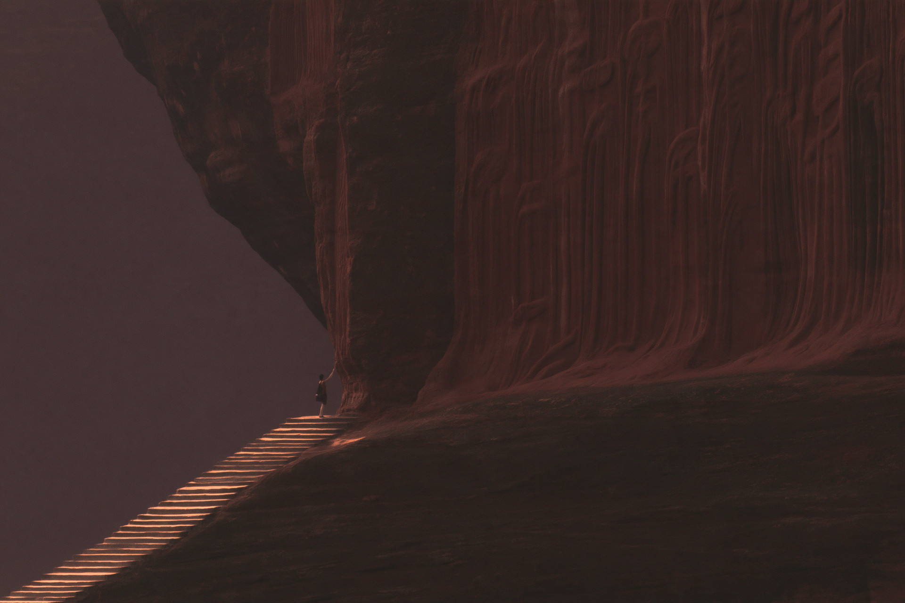
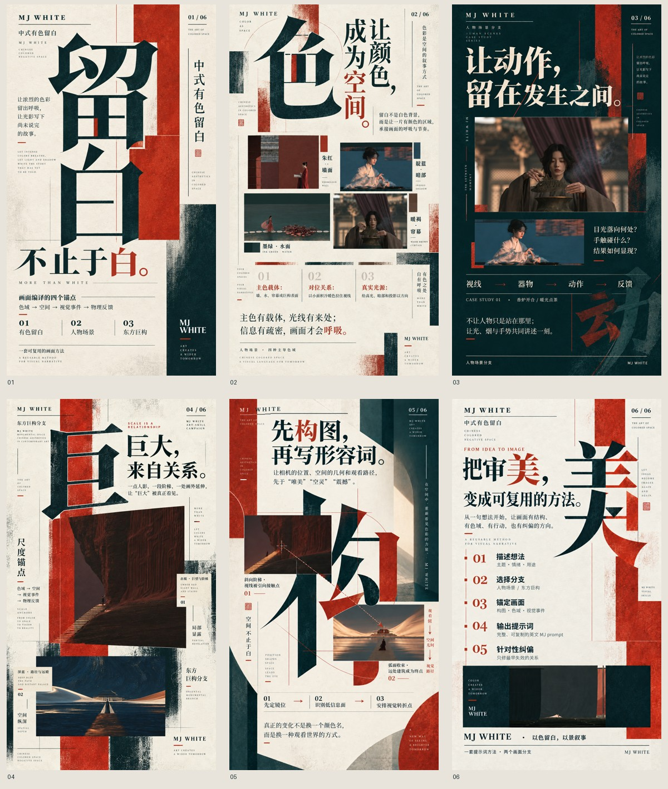

# MJ WHITE｜以色留白，以景叙事

**用途：面向 Midjourney 与 Codex 的提示词设计 Skill。** 它将画面构思整理成可执行的色域、构图、动作或尺度关系，再生成可复制的英文 Midjourney 提示词；本 Skill 不负责调用 Midjourney 生图。

## 两条创作分支

- **人物场景**：组织动作中间态、目光落点、手与器物关系、光线及空间反馈。
- **东方巨构**：用尺度锚点、局部显露、遮挡与空间层级建立巨大感。

这里的“留白”是低信息区域，不等于白色或低饱和背景；红墙、深水、帘幕阴影和巨构表面都可以承载留白。Skill 迁移的是画面关系，而不是复刻案例中的角色、建筑或配色。

## 快速开始

将整个仓库文件夹放进 Codex 的 skills 目录，例如 `$CODEX_HOME/skills/mj-white-skill`；随后在对话中调用 `$mj-white-skill`。

```text
用 $mj-white-skill 设计三张宋式人物场景：先列出彼此不同的动作、主色与构图方案，再写英文 Midjourney 提示词。
```

```text
用 $mj-white-skill 设计一张东方巨构：用远处人物建立尺度，主色深蓝，避免正中对称宫殿。
```

```text
用 $mj-white-skill 诊断这张生成图：指出最早失效的画面关系，只修改相关变量。
```

完整规则见 [SKILL.md](SKILL.md)；案例分支与色系索引见 [references/cases.md](references/cases.md)。

## 精选案例

每个分支内按主导色系各取一张代表图，展示可迁移的空间与观看关系，不是固定提示词模板。

| 人物场景 | 东方巨构 |
|---|---|
|  |  |
|  |  |

[浏览九张案例及迁移边界](references/cases.md)。

## 六页宣传海报



[查看海报与三个版本](showcase/README.md)：可编辑排版版、Image 材质底版、Image 全画面艺术版。艺术重绘稿为 941 × 1672；第 05 页左上和第 06 页底部品牌字样已统一为 `MJ WHITE`。生成式小字和印章可能存在字形偏差，正式传播前请人工校对。

## 检查

```powershell
py -3 verify.py
```

验证 Skill 入口和链接、九张案例图的哈希与色系，以及 18 张海报的格式和尺寸。当前检查不等同于实际 Midjourney 生图效果或生成文字逐字校对。

## 素材与使用说明

本仓库没有声明涵盖全部内容的统一许可证。案例图与作品素材的权利归相应创作者；公开转载或商业使用前请逐项确认使用权。此 Skill 面向 Midjourney 与 Codex 的工作流使用。